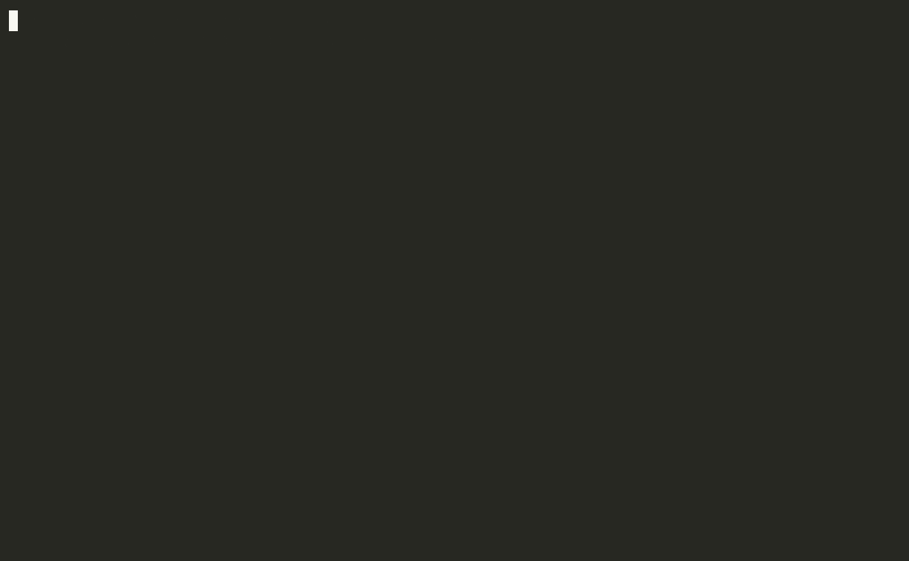
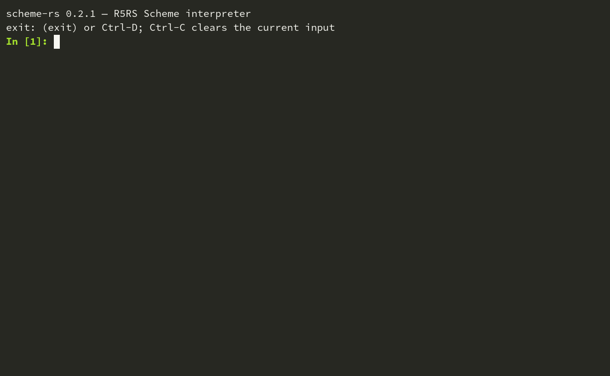

# scheme-rs

[](https://github.com/LiuYinCarl/scheme-rs/actions/workflows/ci.yml)

[中文版 README](README.zh-CN.md)

An R5RS Scheme interpreter written in Rust: a tree-walking evaluator built on
an explicit, persistent continuation stack (a trampoline), giving proper tail
recursion, first-class multi-shot continuations, and correct `dynamic-wind`
re-entry — without using native Rust recursion for evaluation.

## Demo

REPL basics (syntax highlighting, named `let`, exact rationals):



First-class `call/cc` (escape, then re-enter a stored continuation):


Standard library via `require` + `trace` on a library function:


Hygienic macros with `define-syntax`:



Multi-line editing, bignum arithmetic, and `(time)`:


Demos are recorded from scripted REPL sessions (`scripts/record_demos.sh`,
asciinema + agg; see `scripts/demos/*.demo`). How to re-record or add demos:
[docs/demos.md](docs/demos.md).

## Tests & performance (summary)

| Check | Result |
|---|---|
| chibi R5RS suite (`tests/scm/r5rs-tests.scm`) | **188/189** (1 whitelisted case: case-sensitivity conflict, see [notes](docs/testing.md)) |
| SISC R5RS pitfalls (`tests/scm/r5rs_pitfall.scm`) | **22/22** (the trickiest cases: letrec+call/cc, multi-shot continuations, hygienic macros, TCO, etc.) |
| R5RS report examples extraction suite (`tests/scm/r5rs-examples.scm`) | **253/253** |
| Real programs (`tests/scm/programs/`: 11 Gabriel benchmarks + SICP mceval/amb/regmach + Schelog) | **15/15 pass**, including nboyer hitting exactly **95024 rewrites**, the SICP chapter-5 compiler, and an embedded Prolog |
| Rust unit + integration tests | **84** (55 scheme_units + 20 r5rs_suites + 9 in-crate unit tests; single entry point `scripts/test.sh`) |
| Line coverage (cargo-llvm-cov) | **75.17%** (CI gate: 70) |
| CI | fmt / clippy / test (**Ubuntu + macOS**) / coverage / bench all green |

Performance reference (criterion, measured 2026-08-30, Apple M5 / arm64 / 24GB / macOS 26.6,
`cargo bench --bench interpreter`):

| Case | Time | Notes |
|---|---|---|
| `fib_recursion_20` | 29.3 ms | plain recursive calls |
| `tail_loop_100k` | 212.8 ms | 100k tail calls (constant stack, exercises the TCO path) |
| `map_over_1000` | 4.9 ms | built-in map + closure calls |
| `string_and_number_mix` | 661 µs | BigInt arithmetic + string concatenation |
| `reader_r5rs_tests_scm` | 231 µs | reader parsing ~10KB of source |
| **nboyer(0)** (real program, not criterion) | **3.4 s / 95024 rewrites** | ≈ 28k rewrites/s |

Details: [docs/testing.md](docs/testing.md) (test system and full results),
[docs/benchmarks.md](docs/benchmarks.md) (performance deep-dive and how to reproduce).

## Usage

```
cargo build
cargo run -- path/to/file.scm   # run a file
cargo run                        # REPL (syntax highlighting on by default, --no-highlight to disable)
cargo test                       # unit + integration tests (must be green)
```

## Documentation

Design documents (in Chinese, aimed at readers learning interpreter design):

- [docs/guide.md](docs/guide.md) — usage guide: all available procedures with examples
- [docs/architecture.md](docs/architecture.md) — overall architecture: the
  trampoline evaluator, persistent continuation stack, call/cc,
  dynamic-wind, location-based environments
- [docs/syntax-rules.md](docs/syntax-rules.md) — the macro system and renaming-based hygiene
- [docs/numeric-tower.md](docs/numeric-tower.md) — the numeric tower and exactness rules
- [docs/r5rs-compliance.md](docs/r5rs-compliance.md) — R5RS compliance checklist and intentional deviations
- [docs/extensions.md](docs/extensions.md) — extensions beyond R5RS (random/runtime/trace/pretty-print etc.) and the pure-Scheme stdlib modules (list/string/option/result/vector/stream/map/set/format/buffer)
- [docs/demos.md](docs/demos.md) — how the README demo gifs are recorded
- [docs/testing.md](docs/testing.md) — test system, coverage, and full results
- [docs/benchmarks.md](docs/benchmarks.md) — performance deep-dive: criterion and real-program timings

## Development

```
cargo fmt --check                            # formatting (CI gates on this)
cargo clippy --all-targets -- -D warnings    # lints (CI gates on this)
cargo test                                   # unit + integration tests
cargo llvm-cov --all-features --workspace --summary-only   # line coverage
cargo llvm-cov report --all-features --workspace --html    # HTML report
cargo bench --bench interpreter              # criterion benchmarks
```

The REPL is Jupyter-styled (`src/repl.rs`): `In [n]:` / `Out[n]:` numbered
prompts, multi-line editing (a validator keeps unbalanced input in one
editable buffer — cursor can move across lines, and history recalls the
whole multi-line entry at once), ANSI
colors (auto-disabled when not a TTY), syntax highlighting
(`--no-highlight` to disable), live read-error hints shown in dim gray
after the cursor (`--no-hint` to disable), Tab completion from the live global
environment plus special forms, persistent history
(`$XDG_DATA_HOME/scheme-rs/history` or `~/.scheme-rs_history`), Ctrl-C to
discard the current input, `(exit)` or Ctrl-D to quit.

## Architecture

| Module | Contents |
|---|---|
| `src/value.rs` | `Value` representation, symbol interning, gensym/rename table (hygiene), `eq?`/`eqv?`/`equal?` (cycle-safe) |
| `src/reader.rs` | Full datum reader: comments, `#t #f #\c "s" ' ` , ,@`, vectors, dotted pairs, radix/exactness prefixes (`#b #o #d #x #e #i`, composable) |
| `src/printer.rs` | `write`/`display`, quote abbreviations, cycle detection |
| `src/number.rs` | Numeric tower: exact integers (BigInt), exact rationals (BigRational, always normalized), inexact reals (f64); contagion per R5RS |
| `src/env.rs` | Environments mapping symbols to *locations* (`Rc<RefCell<Value>>`), macro namespace, rename-aware resolution, `free-identifier=?` |
| `src/eval.rs` | The trampoline: `State::{Eval, Return, Apply}` + persistent continuation frames; special forms; derived-form desugaring; quasiquote; internal-define handling (letrec semantics with batch assignment) |
| `src/syntax_rules.rs` | Pattern matching (literals, `_`, `.`, nested vectors/lists, nested ellipses, `(... ...)` escape, custom ellipsis identifier), template expansion, hygiene by renaming |
| `src/builtins.rs` | All library procedures |
| `src/port.rs` | stdin/stdout, file ports, string ports |
| `src/repl.rs` | Jupyter-style REPL (rustyline): numbered prompts, continuation lines, completion, history |
| `src/main.rs` | CLI dispatch (file execution vs REPL) |

### Key design points

- **Proper tail recursion.** Evaluation never recurses through Rust's stack for
  Scheme-level control flow. The machine state is an explicit continuation
  stack (`Option<Rc<ContFrame>>`, a persistent linked list). Tail calls reuse
  the current continuation instead of pushing a frame.
  `(let loop ((n 500000)) (if (= n 0) 'done (loop (- n 1))))` runs in constant
  stack space (covered by a unit test).
- **First-class continuations.** Capturing `call/cc` is an O(1) snapshot of the
  continuation-stack pointer plus the dynamic-wind list. Since the stacks are
  persistent, continuations are multi-shot by construction (SISC pitfalls
  7.1–7.4 pass). Escape procedures accept any number of arguments and deliver
  them as multiple values (R5RS 6.4), so the report's own definition of
  `values` via `call/cc` + `apply` works.
- **dynamic-wind.** Each continuation records its wind list. Invoking a
  continuation computes the common prefix of the current and target wind
  lists (by pointer identity) and runs the required `after`/`before` thunks in
  order before resuming.
- **Environments hold locations, not values.** `set!` mutates a shared
  `Rc<RefCell<Value>>` cell, so continuations re-entering a `letrec`
  initializer observe later assignments (pitfalls 1.1/1.2). `letrec` is
  compiled with the "evaluate all inits, then assign all" semantics
  (assignments use fresh temporaries), which pitfalls 1.1/1.2 require.
- **Hygiene.** `syntax-rules` templates rename introduced identifiers to fresh
  unreadable symbols recording (original name, definition environment);
  references that don't find a local binding fall back to the original name in
  the definition environment. Identifiers inside `quote` templates are data
  and are not renamed. Auxiliary syntax (`else`, `=>`, `unquote`,
  `unquote-splicing`, the ellipsis) is recognized by following renames back to
  the original identifier and checking it is not rebound at the use site, so
  e.g. `(let ((=> #f)) (cond (#t => 'ok)))` and
  `(let ((unquote 1)) \`(,foo))` behave per R5RS.
- **map** is implemented over the explicit continuation stack, so it is
  call/cc safe (the pitfall suite prints "Map is call/cc safe ...").

## Coverage

- Syntax: `quote quasiquote unquote unquote-splicing lambda if define set!
  cond case and or let let* letrec named-let begin do delay force
  define-syntax let-syntax letrec-syntax` (including internal defines,
  curried `define`, `cond`/`case` with `=>`, `case` extension).
- Full `syntax-rules`: literals, `_`, dotted patterns, vector patterns,
  nested ellipses, `(... ...)` escape, custom ellipsis identifier.
- Numeric tower: integer / rational / real with exactness contagion;
  `quotient remainder modulo gcd lcm numerator denominator floor ceiling
  truncate round rationalize expt sqrt abs max min exact->inexact
  inexact->exact number->string string->number` (radices supported; integer
  operations accept inexact integers per R5RS 6.2.5; `#` digit placeholders
  per R5RS 6.2.4), plus `exp log sin cos tan asin acos atan`.
- Pairs/lists (all 28 `cxr` combinators, cycle-detecting `list?`, multi-list
  `map`/`for-each`, `apply`), symbols, characters (incl. `char-ci` family),
  strings (incl. `string-ci` family, `string-fill!`, `string-copy`), vectors.
- Control: `procedure? call/cc values call-with-values dynamic-wind eval
  scheme-report-environment null-environment interaction-environment`.
- I/O: full R5RS port set plus extensions `open-input-string
  open-output-string get-output-string call-with-output-string flush-output
  error` (used by the chibi test harness), and `load`.

## Intentional deviations / omissions

- **Complex numbers are omitted.** `complex?` answers `#t` for the supported
  reals/rationals; `sqrt` of a negative number raises an error.
- `scheme-report-environment` / `null-environment` return the full interaction
  environment rather than a restricted report-only environment.
- `char-ready?` always returns `#t`.

## Case sensitivity

Per R5RS section 2 ("Upper and lower case forms of a letter are never
distinguished except within character and string constants"), the **reader
folds identifiers to lower case**; `string->symbol` preserves case, so
`(eq? (string->symbol "f") (string->symbol "F"))` ⇒ `#f` (pitfall 6.1). This
makes the R5RS report's own example `(symbol->string 'Martin)` ⇒ `"martin"`
pass in the r5rs-examples suite. The same expression appears in the chibi
suite expecting `"Martin"` (chibi is case-sensitive) — an unsatisfiable
conflict; that single chibi case is the only entry in the known-failure
whitelist (see `tests/r5rs_suites.rs`).

## Tests

- `tests/r5rs_suites.rs` runs the three bundled suites in process:
  - `tests/scm/r5rs-tests.scm` (chibi R5RS suite): **188/189 pass**; the one
    remaining case is the case-sensitivity conflict above (whitelisted).
  - `tests/scm/r5rs_pitfall.scm` (SISC pitfalls): **all pass** (1.1–8.3,
    plus "Map is call/cc safe").
  - `tests/scm/r5rs-examples.scm` (examples extracted from R5RS chapters
    4/5/6): **253/253 pass**. A handful of extraction artifacts
    (pseudo-examples referencing metavariables or variables that do not
    exist, optional-extension prose mangled into code) were removed from the
    generated file, and two spots where the extractor dropped context from
    the report (the `make-promise` definition of R5RS 4.2.5, half of a
    multi-line expected value) were restored verbatim; see the task log for
    the exact forms.
- `tests/scheme_units.rs`: reader/printer roundtrips, exact arithmetic,
  radix conversions and `#` digit placeholders, inexact integer operations,
  transcendental functions, 500k-deep tail recursion, tail calls in all
  positions, multi-shot `call/cc`, `dynamic-wind` escape/re-entry, macro
  hygiene (definition-site resolution, no capture, nested ellipsis,
  `(... ...)` escape), nested quasiquote, equivalence predicates, case
  folding, string ports, `values`.
- `tests/scm/libs/*-test.scm`: one Scheme test file per stdlib module in
  `src/libs/` (list/string/option/result/vector/stream/map/set/format/
  buffer), driven by the `libs::scheme_libs` test in `tests/r5rs_suites.rs`
  with a `check` assertion harness.
